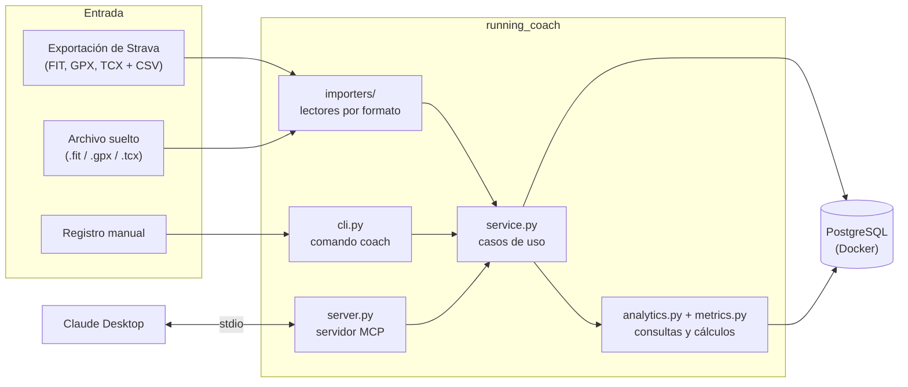

# running-coach

Analiza las carreras grabadas con un reloj **Amazfit** y las pone a disposición de **Claude** a través de un servidor [MCP](https://modelcontextprotocol.io) propio, para que pueda estudiar tu evolución y ayudarte a planificar los entrenamientos.

El proyecto importa el historial desde la exportación de Strava (archivos FIT, GPX y TCX), lo guarda en PostgreSQL, calcula métricas de entrenamiento (volumen semanal, zonas de pulsaciones, carga y relación aguda/crónica) y las expone a Claude como herramientas. Las carreras nuevas se añaden desde la línea de comandos, a mano o con el archivo de la actividad.

<!-- Añade aquí una captura de una conversación con Claude usando las herramientas:
 -->

## Qué puede hacer

- **Importar** el historial completo de una exportación de Strava, combinando los archivos de cada actividad con los datos del `activities.csv`.
- **Añadir carreras nuevas** sin volver a exportar nada: con el archivo de la actividad (`coach add`) o introduciendo los datos a mano (`coach log`), con esfuerzo percibido (RPE) y notas.
- **Analizar** el entrenamiento: resumen semanal, distribución por zonas de pulsaciones y carga de entrenamiento.
- **Conversar con Claude** sobre tus datos: Claude Desktop consulta las métricas mediante herramientas MCP y puede analizar tu estado de forma y proponerte un plan.

## Arquitectura



Cada formato de archivo se traduce a un **modelo común** (`Activity`, `Split`, `TrackPoint`), así que el resto del programa no sabe de dónde vino cada carrera. La lógica de la aplicación vive en una **capa de servicio** que comparten la línea de comandos y el servidor MCP, y que reutilizará una futura interfaz web.

## Decisiones de diseño

**Exportación de Strava en lugar de su API.** La [API Policy de Strava](https://www.strava.com/legal/api_policy) (vigente desde junio de 2026) prohíbe usar los datos obtenidos con su API en aplicaciones de IA y operar servidores MCP propios sobre ellos. Este proyecto trabaja con la exportación de los datos del propio usuario, un derecho que la misma política reconoce, y con los archivos originales del reloj. Como ventaja añadida, no depende de ninguna API de terceros.

**Explorar los datos antes de programar.** Cada importador se escribió después de analizar archivos reales con los scripts de `scripts/`. Así aparecieron detalles que habrían roto el importador: Amazfit escribe el deporte como `Run` en lugar del estándar `Running`, guarda la cadencia por pierna, algunas métricas de dinámica de carrera vienen con una escala errónea y el `activities.csv` tiene columnas duplicadas cuyos nombres dependen del idioma de la cuenta.

**Parciales calculados, no copiados.** Los parciales por kilómetro se calculan siempre a partir de los puntos de la actividad, interpolando el instante exacto de cada kilómetro y descontando las pausas. Así son iguales para los tres formatos. Se validaron contra las vueltas que guarda el propio reloj, con diferencias de 1-2 segundos por kilómetro.

**Totales de Strava para las carreras grabadas con el móvil.** Al comparar la distancia calculada a partir del GPS del móvil con la de Strava, aparecía un exceso sistemático de hasta el 15 %. El diagnóstico (`scripts/diagnose_gpx.py`) identificó tres causas: tramos caminando por cansancio que Strava no cuenta, ratos parado con la aplicación grabando y desviaciones del GPS. Los saltos imposibles del GPS (más de 7 m/s) se filtran, pero como el procesado de Strava no se puede replicar, para los GPX se usan sus totales y los parciales se calculan con los puntos.

**"Sin medir" no es cero.** Las carreras grabadas con el móvil no tienen pulsaciones. En todo el proyecto un dato ausente es `NULL` y se informa aparte, en lugar de contarse como cero, para que las medias de pulsaciones o la carga no se distorsionen.

**Fechas en UTC, semanas en hora local.** Las horas se guardan en UTC (`TIMESTAMPTZ`) y se convierten a la zona horaria del atleta para decidir a qué día y semana pertenece cada carrera. Una carrera el lunes a las 00:30 cuenta en la semana del lunes, aunque en UTC aún sea domingo.

**Integridad en la base de datos.** Los duplicados se evitan con el hash SHA-256 de cada archivo (`UNIQUE` en `source_ref`); los registros manuales, que no tienen archivo, se comparan con las carreras del mismo día y distancia parecida. Las restricciones `CHECK` rechazan valores imposibles y cada carrera se guarda en una transacción junto con sus parciales.

**Métricas explicables.** La carga se mide con el TRIMP de Edwards (minutos en cada zona por el número de la zona), que reutiliza las zonas de pulsaciones y no necesita más datos del perfil. Las zonas se calculan con el método de Karvonen (frecuencia cardíaca de reserva).

**Herramientas pensadas para un modelo.** Las respuestas del servidor MCP usan unidades explícitas en los nombres de los campos, ritmos ya formateados e incluyen notas con las limitaciones de cada métrica, para que Claude no saque conclusiones que los datos no permiten.

## Requisitos

- Python 3.12 y [uv](https://docs.astral.sh/uv/)
- [Docker Desktop](https://www.docker.com/products/docker-desktop/) (en Windows, con WSL2)
- [Claude Desktop](https://claude.ai/download), para la integración con Claude

## Instalación

```bash
git clone https://github.com/NachoMartinezLozano/running-coach.git
cd running-coach

# Credenciales locales de la base de datos (elige una contraseña)
cp .env.example .env

# Arranca PostgreSQL
docker compose up -d

# Instala las dependencias y crea las tablas
uv sync
uv run coach init-db
```

Variables de entorno admitidas en el `.env`:

| Variable | Uso |
|---|---|
| `POSTGRES_DB`, `POSTGRES_USER`, `POSTGRES_PASSWORD` | Credenciales de la base de datos (obligatorias) |
| `POSTGRES_HOST`, `POSTGRES_PORT` | Servidor de PostgreSQL (por defecto, `127.0.0.1:5432`) |
| `DATABASE_URL` | Cadena de conexión completa; si existe, sustituye a las anteriores |
| `RUNNING_COACH_TZ` | Zona horaria del atleta (por defecto, `Europe/Madrid`) |

## Uso

### 1. Importar el historial

Descarga tu exportación desde Strava (*Ajustes → Mi cuenta → Descargar o eliminar tu cuenta → Solicitar archivo*), descomprímela dentro de `data/` e impórtala:

```bash
uv run coach import data/strava_export --since 2025-01-01
```

Por defecto solo se importan carreras de más de 500 m y 3 minutos. Reimportar es seguro: las actividades que ya existen se ignoran.

### 2. Configurar el perfil

```bash
uv run coach profile --max-hr 190 --resting-hr 57 --goal "10 km" --goal-date 2027-01-08 --days 3
```

### 3. Añadir carreras nuevas

```bash
# Introduciendo los datos a mano
uv run coach log 2026-09-30 4.4 25:14 --time 19:30 --hr 156 --rpe 6 --notes "Buenas sensaciones"

# Con el archivo original de la actividad
uv run coach add data/actividad.fit
```

### 4. Consultar las métricas

```bash
uv run coach weeks --weeks 12   # resumen semanal
uv run coach zones --weeks 12   # tiempo en cada zona de pulsaciones
uv run coach load --weeks 8     # carga y relación aguda/crónica
```

### Referencia de comandos

| Comando | Descripción |
|---|---|
| `coach init-db` | Crea las tablas que falten |
| `coach import CARPETA [--since FECHA] [--sport DEPORTE] [--min-distance METROS]` | Importa una exportación de Strava |
| `coach add ARCHIVO...` | Añade actividades desde archivos `.fit`, `.gpx` o `.tcx` (también comprimidos en `.gz`) |
| `coach log FECHA KM DURACIÓN [opciones]` | Registra una carrera a mano: hora, FC media y máxima, desnivel, tipo de sesión, RPE y notas |
| `coach profile [opciones]` | Muestra o actualiza el perfil del atleta |
| `coach weeks [--weeks N]` | Resumen semanal: días, km, tiempo, ritmo, tirada más larga y FC media |
| `coach zones [--weeks N]` | Tiempo en cada zona de pulsaciones |
| `coach load [--weeks N]` | Carga semanal (TRIMP de Edwards) y relación aguda/crónica |

Todos los comandos muestran su ayuda con `--help`.

## Integración con Claude

El servidor MCP se arranca con `uv run running-coach-mcp` y se comunica con Claude Desktop por la entrada y salida estándar. Para registrarlo, abre en Claude Desktop **Configuración → Desarrollador → Editar configuración** y añade:

```json
{
  "mcpServers": {
    "running-coach": {
      "command": "RUTA_COMPLETA_A/uv",
      "args": ["--directory", "RUTA_COMPLETA_AL/running-coach", "run", "running-coach-mcp"]
    }
  }
}
```

La ruta de `uv` se obtiene con `which uv` (macOS y Linux) o `(Get-Command uv).Source` (PowerShell). En Windows, las barras invertidas de las rutas se escriben dobles (`\\`). Tras reiniciar Claude Desktop, el servidor debe aparecer **En ejecución** en esa misma pantalla. Docker tiene que estar arrancado para que las herramientas puedan leer la base de datos.

> En Windows, si Claude Desktop se instaló desde la Microsoft Store, sus archivos están virtualizados en `%LOCALAPPDATA%\Packages\Claude_*\LocalCache\`. Abrir la configuración con el botón *Editar configuración* garantiza que se edita el archivo correcto.

### Herramientas disponibles

| Herramienta | Qué devuelve |
|---|---|
| `get_athlete_profile` | Fecha de hoy, objetivo y días que faltan, disponibilidad, FC máxima y en reposo, zonas de pulsaciones |
| `get_weekly_summary` | Volumen por semanas: días con carrera, km, tiempo, ritmo, tirada más larga y FC media |
| `get_intensity_distribution` | Tiempo y porcentaje en cada zona de pulsaciones |
| `get_training_load` | Carga semanal y relación aguda/crónica de carga y kilómetros |
| `list_recent_runs` | Carreras recientes con ritmo, pulsaciones, RPE y notas |
| `log_run` | Registra una carrera contada en la conversación, con detección de posibles duplicados |
| `delete_run` | Borra una carrera, para corregir errores |

Ejemplo de uso en Claude Desktop:

> Usa running-coach para analizar mis últimas 12 semanas de carrera. ¿Cómo voy de cara a mi 10K del 8 de enero?

## Tests

Los tests de la base de datos usan una base de datos propia, que se vacía en cada test y nunca toca los datos reales. Créala una vez:

```bash
docker compose exec db createdb -U coach running_coach_test
uv run pytest
```

Los importadores y las métricas se prueban con datos sintéticos generados en los propios tests (carreras a ritmo constante, pausas, pérdidas de señal, saltos del GPS, CSV en español e inglés...), y la capa de datos, contra un PostgreSQL real. Si el contenedor no está arrancado, los tests de base de datos se marcan como omitidos en lugar de fallar.

## Estructura del proyecto

```
running-coach/
├── src/running_coach/
│   ├── models.py          # Modelo común: Activity, Split, TrackPoint, AthleteProfile
│   ├── importers/
│   │   ├── fit_importer.py, gpx_importer.py, tcx_importer.py   # un lector por formato
│   │   ├── common.py      # parciales, distancias, desnivel, detección de pausas
│   │   ├── files.py       # elige el lector según la extensión
│   │   ├── strava_csv.py  # activities.csv, independiente del idioma
│   │   └── strava_export.py   # combina archivos y CSV, aplica filtros
│   ├── schema.sql         # tablas, claves y restricciones
│   ├── db.py              # acceso a PostgreSQL
│   ├── metrics.py         # cálculos puros: ritmo, zonas, TRIMP, relación aguda/crónica
│   ├── analytics.py       # consultas de análisis
│   ├── service.py         # casos de uso compartidos
│   ├── cli.py             # comando coach
│   └── server.py          # servidor MCP
├── tests/
├── scripts/               # exploración y validación de los datos reales
├── compose.yaml           # PostgreSQL con Docker
└── .env.example
```

## Privacidad

Los datos de actividad contienen ubicaciones y horarios. La carpeta `data/`, los archivos de actividad (`.fit`, `.gpx`, `.tcx`), las bases de datos y el `.env` están excluidos del repositorio en el `.gitignore`. La base de datos solo escucha en `127.0.0.1`, y los datos únicamente salen del ordenador cuando Claude los consulta a través de las herramientas, con el permiso del usuario.

## Limitaciones conocidas

- En las carreras grabadas con el móvil, los totales vienen de Strava y los parciales de los puntos GPS, así que sus distancias no suman exactamente lo mismo.
- Las zonas de pulsaciones se aproximan por kilómetro: cada parcial cuenta entero en la zona de su FC media.
- La FC máxima del perfil es la registrada, que puede ser inferior a la real.
- La relación aguda/crónica es orientativa: su valor predictivo se discute en la literatura y, con pocas carreras por semana, es muy variable.
- El esquema se crea con `CREATE TABLE IF NOT EXISTS`; aún no hay migraciones para modificar tablas existentes.

## Hoja de ruta

- [x] Importadores FIT, GPX y TCX validados con datos reales
- [x] PostgreSQL con Docker, deduplicación y transacciones
- [x] Métricas: resumen semanal, zonas de pulsaciones y carga
- [x] Registro de carreras desde la línea de comandos
- [x] Servidor MCP con herramientas de análisis
- [x] Registro y borrado de carreras desde la conversación con Claude
- [ ] Detalle por kilómetros de una carrera y edición del perfil desde la conversación
- [ ] Planes de entrenamiento persistentes: sesiones planificadas frente a realizadas
- [ ] Migraciones del esquema (Alembic)
- [ ] Integración continua con GitHub Actions
- [ ] Interfaz web con calendario, gráficas y formulario de registro
- [ ] Suavizado de las trayectorias GPS (filtro de Kalman)

## Aviso

Las métricas y los planes que se generan con este proyecto son orientativos y no sustituyen el criterio de un entrenador ni el de un profesional sanitario.
